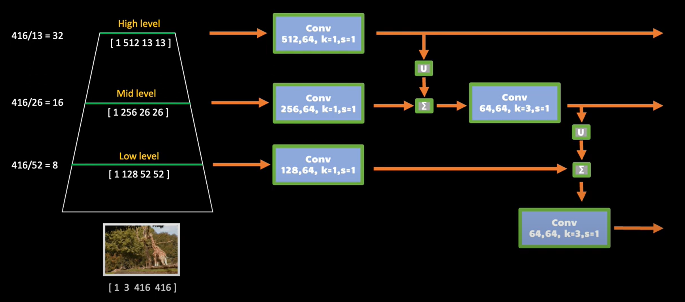

# DL4-Healthcare

##### This project is aimed to predict the patients has COVID or not through provided CT image. Below is how the data looks like

##### link to repo: https://github.com/xxx595588/DL4-Healthcare

## Introduction

The COVID-19 pandemic necessitates swift and accurate diagnoses to control its spread. Traditional nucleic acid tests, while standard, face limitations in speed and availability. Computed tomography (CT) imaging offers a rapid alternative but requires expertise for interpretation, posing challenges in differentiating COVID-19 from similar respiratory conditions. An automated diagnostic tool leveraging deep learning to analyze CT images could significantly aid in distinguishing COVID-19 from bacterial pneumonia and healthy lungs, enhancing patient management and treatment efficiency.

Our study presents a deep learning approach using computed tomography (CT) images to address the critical need for rapid and accurate COVID-19 diagnosis. We introduce a specialized deep learning model, DRENet (Details Relation Extraction Network), aimed at differentiating COVID-19 from bacterial pneumonia and normal lung conditions.

## Data Preparation

A diverse dataset comprising chest CT scans from 88 COVID-19 patients, 100 bacterial pneumonia patients, and 86 healthy individuals was compiled from multiple hospitals. Rigorous preprocessing, including normalization and augmentation, was performed to prepare the data for model training.


```python
import matplotlib.pyplot as plt 
import matplotlib.image as img
import numpy as np
  
# reading the image 
no_cov_image = img.imread('local_traniner/input/test/nCoV/test-nCoV-000_series2_2_28.0.jpg')
cov_image = img.imread('local_traniner/input/test/no_nCoV/test-no_nCoV-000_1276254_CT_Chest Enhancement[20170629]-Series_005_Thorax  5.0  B70f-IMG00022.jpg')

fig = plt.figure()
ax1 = fig.add_subplot(121)
ax2 = fig.add_subplot(122)
ax1.imshow(cov_image)
ax2.imshow(no_cov_image)
ax1.title.set_text('COVID')
ax2.title.set_text('Non COVID')
plt.show()
```

## Dataset


```python
import os
import torchvision
import random
from PIL import Image
from torchvision import transforms
random.seed(0)

class CustomDataset(torchvision.datasets.VisionDataset):
    def __init__(self, root, is_train=True):
        super(CustomDataset, self).__init__(root, transforms=None)
        self.is_train = is_train
        self.file_lst, self.label_lst = [], []
        for label, folder in enumerate(['no_nCoV', 'nCoV']):
            path = os.path.join(root, folder)
            files = os.listdir(path)
            
            self.file_lst.extend(os.path.join(path, file) for file in files)
            self.label_lst.extend([label] * len(files))

        self.transform = transforms.Compose([
            transforms.Resize((448, 448)),
            transforms.RandomHorizontalFlip() if is_train else transforms.Lambda(lambda x: x),
            transforms.ColorJitter(brightness=0.126, saturation=0.5) if is_train else transforms.Lambda(lambda x: x),
            transforms.ToTensor(),
            transforms.Normalize([0.485, 0.456, 0.406], [0.229, 0.224, 0.225])
        ])

    def __getitem__(self, index):
        file_path = self.file_lst[index]
        img = Image.open(file_path).convert('RGB')

        img = self.transform(img)
        label = self.label_lst[index]

        return img, label

    def __len__(self):
        return len(self.file_lst)
```

## Scope of reproducibility

We are able to produce the stable prediction model around 92% - 96% accuracy by given training CT image data during our 30 epochs trining process.

## Plan

We will first apply feature extraction which utilizes ResNet50 for global feature extraction from the CT scans and a Feature Pyramid Network (FPN) to identify significant local features, particularly focusing on lung abnormalities. After feature extraction, we will extract details relation and analyzes the relationships between the local features to enhance the model’s diagnostic accuracy, providing a deeper understanding of the lung conditions then will start training and validation process.ns.ies.

## Model Definition

In our model, we first apply Residual Networks **(ResNet)** with Feature Pyramid Networks **(FPN)**.

https://www.youtube.com/watch?v=FKsgO0U7CUw


For each level (there are 5 in this model), the **resnet_fpn_backbone()** will produce a 256 channels image then it will be sent into the **nn.Sequential()**. The image will firts be convoluted, Batch normalization, ReLU, then average pooling. The output will be **(1,2)** 

After finishing processing all levels, we will get **(5, 1, 2)** as the ouotput (5 levels, and each row contains 2 values, one is COVID the other is non-COVID). The last step is to apply self attention and softmax to calculate for appropriate weights and produce the output,

## Training and Validation

DRENet was subjected to comprehensive training and validation processes, with performance evaluated using metrics such as Area Under the Curve (AUC), recall, precision, and F1 score.


```python
import torch
import numpy as np
import torchvision
import torch.nn.functional as F
from torchvision.models import ResNet50_Weights
from torch import nn

class DRE_net(nn.Module):
    def __init__(self, n_class):
        super(DRE_net, self).__init__()
        self.n_class = n_class

        self.backbone = torchvision.models.detection.backbone_utils.resnet_fpn_backbone(backbone_name='resnet50', weights=ResNet50_Weights.DEFAULT)
        in_channels_list = [256, 256, 256, 256, 256]

        self.prediction_layers = nn.ModuleDict({
            str(i): nn.Sequential(
                nn.Conv2d(in_channels=in_channels_list[i], out_channels=n_class, kernel_size=1),
                nn.BatchNorm2d(n_class),
                nn.ReLU(),
                nn.AdaptiveAvgPool2d(1)
            ) for i in range(len(in_channels_list))
        })

        self.attention = nn.Linear(len(in_channels_list) * n_class, len(in_channels_list))

    def forward(self, x):
        feature_maps = self.backbone(x)

        preds = [self.prediction_layers[str(i)](feature_map) for i, feature_map in enumerate(feature_maps.values())]
        # Squeeze each tensor in preds
        preds = [p.view(p.size(0), -1) for p in preds]

        concatenated = torch.cat(preds, dim=1)

        # Predict the attention scores
        attn_scores = self.attention(concatenated)
        attn_weights = F.softmax(attn_scores, dim=1)

        # adjust shapes for both attn_weights and preds
        attn_weights = attn_weights.unsqueeze(-1)
        preds = torch.stack(preds, dim=1)

        # Sum the weighted preds
        output = (attn_weights * preds).sum(dim=1)

        return output
```


```python
import os
import torch
from torch import nn, optim
from torch.utils.data import DataLoader
from local_traniner.model.core.dataset import CustomDataset
from local_traniner.model.core.model import DRE_net

model_path = 'DRE-Net.pth'
best_model_path = 'BEST_DRE-Net.pth'

BATCH_SIZE = 4
EPOCHS = 30

device = torch.device('cuda' if torch.cuda.is_available() else 'cpu')
print('Using device:', device)
print()

if device.type == 'cuda':
    print(torch.cuda.get_device_name(0))
    print('Memory Usage:')
    print('Allocated:', round(torch.cuda.memory_allocated(0) / 1024 ** 3, 1), 'GB')
    print('Cached:   ', round(torch.cuda.memory_reserved(0) / 1024 ** 3, 1), 'GB')
    print()

train_path = os.path.join('local_traniner', 'input', 'train')
val_path = os.path.join('local_traniner', 'input', 'val')
test_path = os.path.join('local_traniner', 'input', 'test')

train_data = CustomDataset(root=train_path, is_train=True)
val_data = CustomDataset(root=val_path, is_train=False)
test_data = CustomDataset(root=test_path, is_train=False)

train_loader = DataLoader(train_data, batch_size=BATCH_SIZE, shuffle=True, num_workers=0, drop_last=False)
val_loader = DataLoader(val_data, batch_size=BATCH_SIZE, shuffle=False, num_workers=0, drop_last=False)
test_loader = DataLoader(val_data, batch_size=BATCH_SIZE, shuffle=False, num_workers=0, drop_last=False)


def calculate_accuracy(dataloader: DataLoader, model: nn.Module):
    correct = 0.
    total = 0.

    model.eval()
    with torch.no_grad():
        for images, labels in dataloader:
            images = images.to(device)
            labels = labels.to(device)

            outputs = model(images)
            _, pred = torch.max(outputs, 1)

            correct += (pred == labels).sum().cpu().numpy()
            total += labels.size(0)

    return 100 * correct / total
```

    Using device: cuda
    
    NVIDIA GeForce RTX 3070 Ti Laptop GPU
    Memory Usage:
    Allocated: 0.2 GB
    Cached:    0.2 GB
    
    


```python
model = DRE_net(n_class=2).to(device)
criterion = nn.CrossEntropyLoss()
optimizer = optim.SGD(model.parameters(), lr=0.002, momentum=0.9, weight_decay=1e-4)
best = float('-inf')
# checkpoint = torch.load(model_path)
# epoch = checkpoint['epoch']
# model.load_state_dict(checkpoint['model_state_dict'])
# optimizer.load_state_dict(checkpoint['optimizer_state_dict'])
# loss = checkpoint['loss']
# val_accuracy = checkpoint['val_accuracy']
loss_log = []

for epoch in range(EPOCHS):
    model.train()
    running_loss = 0.0
    for images, labels in train_loader:
        images = images.to(device)
        labels = labels.to(device)

        # Zero the parameter gradients
        optimizer.zero_grad()

        # Forward pass
        outputs = model(images)
        loss = criterion(outputs, labels)

        # Backward and optimize
        loss.backward()
        optimizer.step()

        running_loss += loss.item()

    print(f"Epoch [{epoch + 1}/{EPOCHS}], Loss: {running_loss / len(train_loader)}")
    loss_log.append(running_loss / len(train_loader))

    if (epoch + 1) % 5 == 0:
        val_accuracy = calculate_accuracy(val_loader, model)
        print(f"Accuracy of the network on the val images: {val_accuracy:.1f} %")

        if val_accuracy > best:
            best = val_accuracy
            torch.save({
            'epoch': epoch + 1,
            'model_state_dict': model.state_dict(),
            'optimizer_state_dict': optimizer.state_dict(),
            'loss': running_loss,
            'val_accuracy': val_accuracy
        }, best_model_path)
            
        torch.save({
            'epoch': epoch + 1,
            'model_state_dict': model.state_dict(),
            'optimizer_state_dict': optimizer.state_dict(),
            'loss': running_loss,
            'val_accuracy': val_accuracy
        }, model_path)

test_accuracy = calculate_accuracy(test_loader, model)
print(f"Accuracy of the final network on the test images: {test_accuracy:.1f} %")
```

    Epoch [1/30], Loss: 0.5974010230149126
    Epoch [2/30], Loss: 0.5333049783307916
    Epoch [3/30], Loss: 0.4696941920896856
    Epoch [4/30], Loss: 0.4606979914554736
    Epoch [5/30], Loss: 0.4396956813252346
    Accuracy of the network on the val images: 90.5 %
    Epoch [6/30], Loss: 0.40732476769424064
    Epoch [7/30], Loss: 0.38212885564835647
    Epoch [8/30], Loss: 0.36377576084398644
    Epoch [9/30], Loss: 0.3491988864561822
    Epoch [10/30], Loss: 0.3390932773931101
    Accuracy of the network on the val images: 75.6 %
    Epoch [11/30], Loss: 0.3902446105816638
    Epoch [12/30], Loss: 0.3561269870151211
    Epoch [13/30], Loss: 0.3402074338926671
    Epoch [14/30], Loss: 0.3160816310719954
    Epoch [15/30], Loss: 0.2738111034191444
    Accuracy of the network on the val images: 97.0 %
    Epoch [16/30], Loss: 0.28554764008376654
    Epoch [17/30], Loss: 0.30403443450555984
    Epoch [18/30], Loss: 0.2488749231299457
    Epoch [19/30], Loss: 0.2949309121389007
    Epoch [20/30], Loss: 0.2677265926806146
    Accuracy of the network on the val images: 86.7 %
    Epoch [21/30], Loss: 0.20857454745507822
    Epoch [22/30], Loss: 0.27858893217629255
    Epoch [23/30], Loss: 0.218139741141414
    Epoch [24/30], Loss: 0.1917320122286833
    Epoch [25/30], Loss: 0.20180712714272095
    Accuracy of the network on the val images: 96.3 %
    Epoch [26/30], Loss: 0.20300572908739803
    Epoch [27/30], Loss: 0.257031947887058
    Epoch [28/30], Loss: 0.19456152871043425
    Epoch [29/30], Loss: 0.18311162557102453
    Epoch [30/30], Loss: 0.24159687599783783
    Accuracy of the network on the val images: 96.6 %
    Accuracy of the final network on the test images: 96.6 %
    


```python
loss_output = [val*100 for val in loss_log]
plt.plot(range(len(loss_log)), loss_output, marker='.')
plt.title('Loss rate v.s. Epoch')
plt.xlabel('Epoch')
plt.ylabel('Loss(%)')
plt.show()
```


    

    


Following block will load the model


```python
checkpoint = torch.load(best_model_path)
#epoch = checkpoint['epoch']
model.load_state_dict(checkpoint['model_state_dict'])
# optimizer.load_state_dict(checkpoint['optimizer_state_dict'])
# loss = checkpoint['loss']
# val_accuracy = checkpoint['val_accuracy']
```


    <All keys matched successfully>


```python
val_accuracy = calculate_accuracy(val_loader, model)
val_accuracy
```


    97.0383275261324


## References
[1]  S  Ying, et al. 2020. Deep Learning E
ables Accurate Diagnosis of Novel Coro
2
avirus (COVID-19) with CT Images. med.

[2] Deep learning enables accurate diagnosis of novel coronavirus (COVID-19) with CT images images
